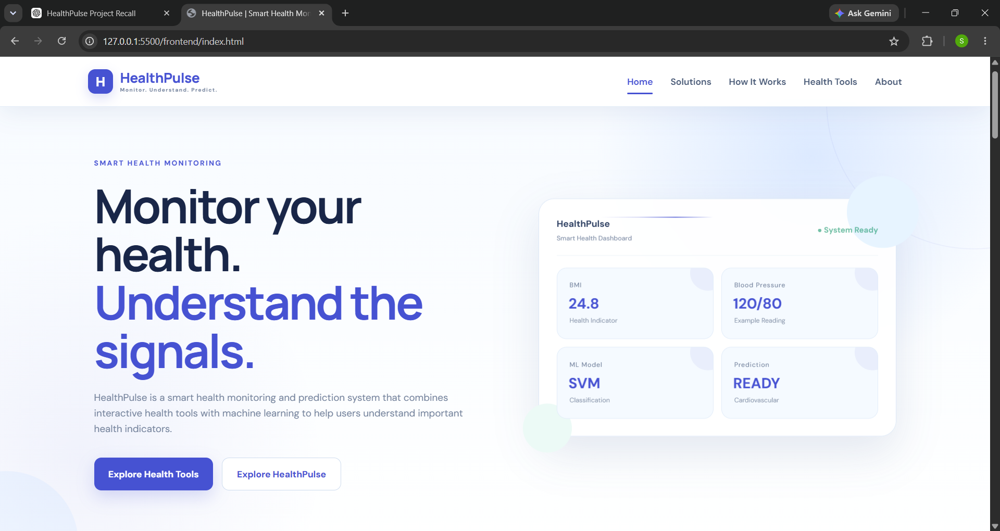
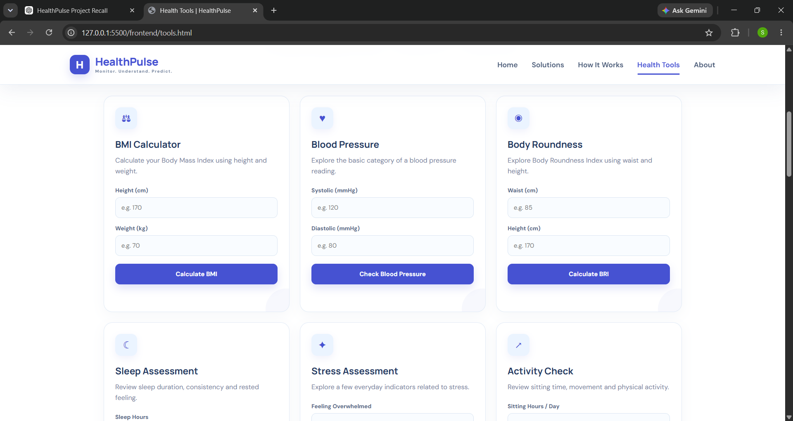
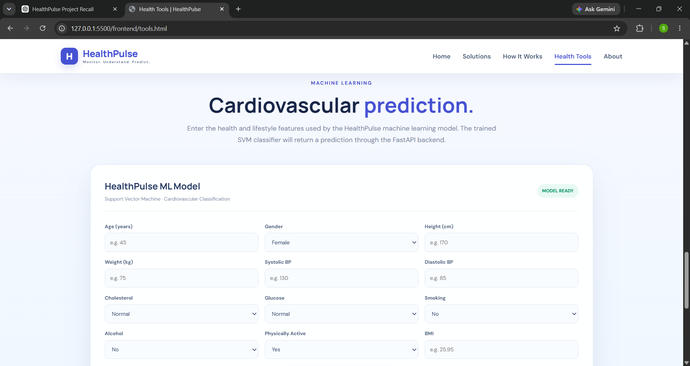
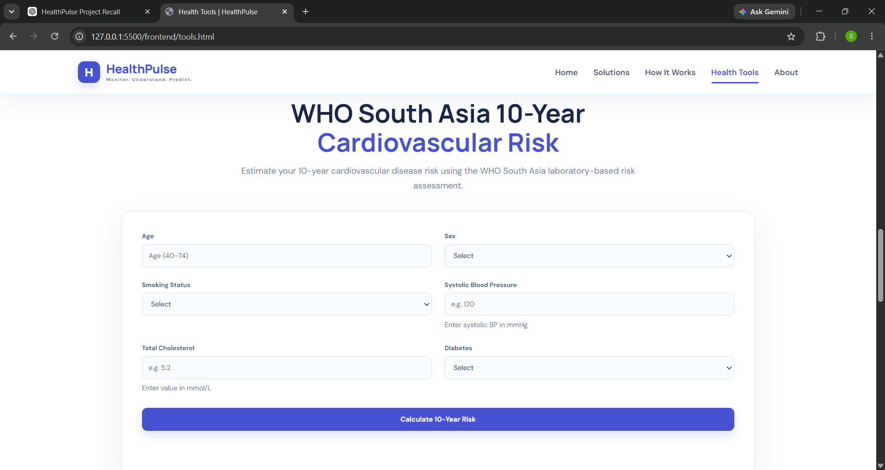
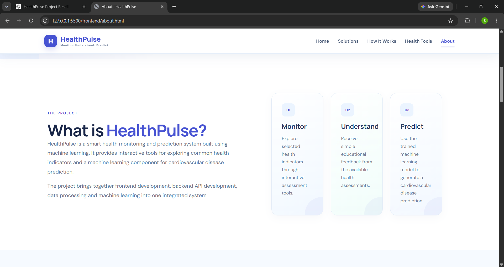

# HealthPulse - Smart Health Monitoring and Prediction System Using Machine Learning

> **Monitor. Understand. Predict.**

HealthPulse is a web-based healthcare project developed to provide basic health assessments, **machine learning-based cardiovascular disease prediction**, and a **WHO South Asia 10-year cardiovascular risk assessment** in one platform.

The project combines a web frontend, FastAPI backend, machine learning, and a WHO-based cardiovascular risk assessment system.

---

## Project Preview

### Home Page

### Health Tools

### Cardiovascular Disease Prediction

### WHO South Asia Cardiovascular Risk Assessment

### About Page

---

## About the Project

Cardiovascular health is influenced by several factors such as **age, blood pressure, cholesterol, smoking, diabetes, physical activity**, and other health conditions.

HealthPulse brings different health-related features together in a single web application. Users can use basic health assessment tools, enter health information for cardiovascular disease prediction, and perform a separate WHO South Asia 10-year cardiovascular risk assessment.

The project is developed mainly for **educational and health-awareness purposes**. The results should not be considered a medical diagnosis or a replacement for professional medical advice.

---

## Features

### Health Tools

HealthPulse provides basic health-awareness tools including:

- **BMI Calculator**
- **Blood Pressure Assessment**
- **Body Roundness Index (BRI)**
- **Sleep Assessment**
- **Stress Assessment**
- **Sedentary Activity Assessment**

### Machine Learning Cardiovascular Prediction

The system uses a **Support Vector Machine (SVM)** model to predict the possibility of cardiovascular disease based on health-related input data.

The model uses:

- Age
- Gender
- Height
- Weight
- Systolic Blood Pressure
- Diastolic Blood Pressure
- Cholesterol
- Glucose
- Smoking
- Alcohol Consumption
- Physical Activity
- BMI

The **trained model is already included in the project** and is loaded by the FastAPI backend when the application runs.

### WHO South Asia 10-Year Cardiovascular Risk

HealthPulse also includes a separate **WHO South Asia cardiovascular risk assessment**.

The assessment uses:

- Age
- Sex
- Smoking Status
- Systolic Blood Pressure
- Total Cholesterol
- Diabetes Status

The assessment provides:

- **10-year cardiovascular risk percentage**
- **Risk category**
- Relevant WHO risk groups

The WHO assessment supports ages **40 to 74 years**.

---

## Machine Learning

HealthPulse uses a **Support Vector Machine (SVM)** with an **RBF kernel** for cardiovascular disease prediction.

The machine learning pipeline consists of feature scaling followed by SVM classification.

StandardScaler  
↓  
SVM Classifier

The trained model is already available in the project at:

`ml/healthpulse_model.pkl`

The **FastAPI backend loads this trained model** and uses it to generate predictions.

### Model Evaluation

The model was evaluated using a separate test set.

| Metric | Score |
|---|---:|
| **Accuracy** | **72.85%** |
| **Precision** | **74.12%** |
| **Recall** | **70.19%** |
| **F1 Score** | **72.10%** |
| **ROC-AUC** | **78.55%** |

### Confusion Matrix

**[[5283, 1713], [2084, 4907]]**

Where:

- **True Negatives = 5283**
- **False Positives = 1713**
- **False Negatives = 2084**
- **True Positives = 4907**

---

## WHO South Asia Risk Assessment

The **WHO South Asia risk assessment** is implemented as a separate component from the machine learning prediction.

### Age Groups

- 40-44
- 45-49
- 50-54
- 55-59
- 60-64
- 65-69
- 70-74

### Systolic Blood Pressure Groups

- <120
- 120-139
- 140-159
- 160-179
- ≥180

### Total Cholesterol Groups

- <4
- 4-4.9
- 5-5.9
- 6-6.9
- >=7

Total cholesterol is entered in **mmol/L**.

### Risk Categories

| Risk Percentage | Category |
|---|---|
| **<5%** | Very Low Risk |
| **5% to <10%** | Low Risk |
| **10% to <20%** | Moderate Risk |
| **20% to <30%** | High Risk |
| **≥30%** | Very High Risk |

---

## System Architecture

**USER**  
↓  
**HealthPulse Frontend**  
HTML / CSS / JavaScript  
↓  
**API Requests**  
↓  
**FastAPI Backend**  
↓  
**SVM Model Prediction** + **WHO Risk Data and Risk Logic**  
↓  
**Result to User**

---

## API Endpoints

HealthPulse uses **FastAPI** for backend communication.

### Health Check

`GET /`

Checks whether the HealthPulse API is running.

### Cardiovascular Prediction

`POST /predict`

Receives health-related information and returns the **cardiovascular disease prediction**.

### WHO Risk Assessment

`POST /who-risk`

Receives WHO risk assessment inputs and returns the **10-year cardiovascular risk**.

---

## Technology Stack

### Frontend

- **HTML5**
- **CSS3**
- **JavaScript**

### Backend

- **Python**
- **FastAPI**
- **Uvicorn**
- **Pydantic**

### Machine Learning

- **Scikit-learn**
- **Support Vector Machine**
- **StandardScaler**
- **Pandas**
- **Joblib**

### Development Tools

- **Visual Studio Code**
- **Live Server**
- **Git**
- **GitHub**

---

## Project Structure

HealthPulse/  
│  
├── backend/  
│   ├── __init__.py  
│   ├── database.py  
│   ├── main.py  
│   ├── models.py  
│   ├── schemas.py  
│   └── who_risk.py  
│  
├── data/  
│   ├── cardio_cleaned.csv  
│   ├── cardio_train.csv  
│   └── who_south_asia_risk.csv  
│  
├── ml/  
│   ├── eda.py  
│   ├── evaluate_model.py  
│   ├── healthpulse_model.pkl  
│   └── prepare_data.py  
│  
├── frontend/  
│   ├── css/  
│   ├── js/  
│   ├── index.html  
│   ├── solutions.html  
│   ├── tools.html  
│   ├── how-it-works.html  
│   └── about.html  
│  
├── screenshots/  
│   ├── home.png  
│   ├── health-tools.png  
│   ├── prediction.png  
│   ├── who-risk.png  
│   └── about.png  
│  
└── README.md

---

## How to Run the Project

### 1. Clone the Repository

`git clone https://github.com/soumya-prasad-1/HealthPulse.git`

`cd HealthPulse`

### 2. Create a Virtual Environment

`python -m venv .venv`

### 3. Activate the Virtual Environment

On Windows:

`.venv\Scripts\activate`

### 4. Install Required Packages

`pip install fastapi uvicorn pandas scikit-learn joblib pydantic`

### 5. Start the Backend

From the project root directory, run:

`uvicorn backend.main:app --reload`

The backend will run at:

`http://127.0.0.1:8000`

### 6. Open API Documentation

FastAPI Swagger documentation is available at:

`http://127.0.0.1:8000/docs`

### 7. Run the Frontend

Open the project in Visual Studio Code.

Open the `frontend` folder and run:

`frontend/index.html`

using the **Live Server** extension.

Make sure the **FastAPI backend is running** when using the cardiovascular prediction and WHO risk assessment features.

---

## Example WHO Risk Assessment

### Example Input

- **Age:** 55
- **Sex:** Male
- **Smoking:** Non-smoker
- **Systolic BP:** 145 mmHg
- **Total Cholesterol:** 5.2 mmol/L
- **Diabetes:** No

### Example Result

**10-Year Risk: 8%**

**Risk Category: Low Risk**

The input is mapped to:

- **Age Group:** 55-59
- **SBP Group:** 140-159
- **Cholesterol Group:** 5-5.9
- **Smoking:** Non-smoker
- **Diabetes:** No

---

## Project Results

The current HealthPulse implementation integrates:

- **Web-based health tools**
- **SVM-based cardiovascular disease prediction**
- **FastAPI backend**
- **WHO South Asia 10-year cardiovascular risk assessment**
- **Frontend-backend API communication**
- **Machine learning model evaluation**

The machine learning model achieved:

**72.85% Accuracy**

with:

- **Precision:** 74.12%
- **Recall:** 70.19%
- **F1 Score:** 72.10%
- **ROC-AUC:** 78.55%

---

## Future Scope

Future improvements can include:

- **User authentication**
- **Health assessment history**
- **Improved machine learning models**
- **Explainable AI**
- **Cloud deployment**
- **Mobile application**
- **Integration with wearable health devices**
- **Health alerts and notifications**

---

## Disclaimer

HealthPulse is developed for **educational and health-awareness purposes only**.

The machine learning predictions and WHO-based risk assessments are **not medical diagnoses** and should not be used as a replacement for consultation with a qualified healthcare professional.

---

## References

### WHO South Asia Cardiovascular Risk Assessment

World Health Organization - South Asia Cardiovascular Disease Risk Assessment Chart.

https://www.who.int/docs/default-source/cardiovascular-diseases/south-asia.pdf?sfvrsn=c5b0d9a32

### Scikit-learn

https://scikit-learn.org/

### FastAPI

https://fastapi.tiangolo.com/

---

## Author

**Soumya Prasad**